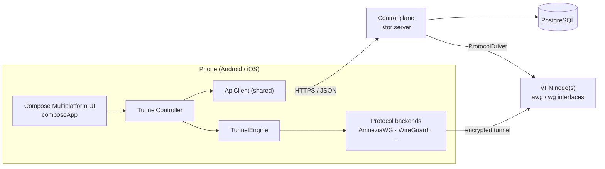

# Architecture

**Two planes.** The *control plane* (`server/`) knows accounts, devices, plans and which peer
belongs to whom. It never carries user traffic. The *data plane* is the VPN node(s): a
WireGuard-family interface the control plane programs through a `ProtocolDriver`. Today the
driver runs the `awg` / `wg` CLI on the same host. A remote node agent implements the same
interface when you add servers.

## Shared module (`shared/`)

One Kotlin source of truth for everything that crosses the network:

- `Models.kt`: every request/response type (`MeRes`, `TunnelConfig`, `StatsRes`, …)
- `Protocols.kt`: per-protocol parameter shapes (`WireGuard`, `AmneziaWG`)
- `ApiClient.kt`: typed client used by the apps *and* the server tests
- `Format.kt`: byte/speed/duration formatting

Compiled for JVM (server), Android and iOS.

## Protocols

The core never hard-codes a protocol. A tunnel is a `protocol` id plus two JSON objects:

| Step | Who | Data |
|---|---|---|
| 1 | device → server | `TunnelProvisionReq{protocol, serverId?, clientParams}` (non-secret, e.g. a public key) |
| 2 | server → node | `ProtocolDriver.addPeer(...)` |
| 3 | server → device | `TunnelConfig{protocol, address, dns, mtu, params}` |
| 4 | device | `TunnelEngine.start(config)` → the backend for `protocol` |

Adding a protocol touches only:

1. `shared/.../Protocols.kt`: its `ClientParams` / `ServerParams` (optional but recommended)
2. `server/.../protocols/`: a `ProtocolDriver`, listed in `AVAILABLE_DRIVERS`
3. Android: an `AndroidTunnelBackend` in `androidApp/src/<variant>/.../Backends.kt`
4. iOS: a `TunnelBackend` in `iosApp/PacketTunnel/`, listed in `PacketTunnelProvider.backends`
5. `ProtocolInfo` in the app for its display name

No table, endpoint or screen changes. The database stores protocol data in `jsonb`.

**Choosing a protocol.** The server lists each node's protocols in preference order (the
`PROTOCOLS` setting, default `amneziawg,wireguard`). On "Automatic", the app picks the first one
the device can run. Users can pin one in Settings › Protocol.

### AmneziaWG (default)

[AmneziaWG](https://github.com/amnezia-vpn/amneziawg-go) is WireGuard with obfuscation against
deep packet inspection: junk packets before handshakes (Jc/Jmin/Jmax), padded messages
(S1–S4), randomised message headers (H1–H4), custom signature packets (I1–I5) and, from AWG 3,
header protection. Keys and handshake are WireGuard's, so the device sends the same
`clientParams`. `params.obfuscation` carries the node's values as awg-quick keys, passed through
verbatim so new AWG versions need no app release.

- Server-side keys (S1–S4, H1–H4, HeaderProtectionKey) must equal the node's interface config.
  `./gradlew :server:awgParams` generates a valid profile.
- With no obfuscation values AmneziaWG is wire-compatible WireGuard. So on both mobile platforms
  one library (amneziawg-android, amneziawg-apple) serves both protocols. That's also forced:
  the AmneziaWG and WireGuard libraries ship the same native library name and can't share an app.
- `jaga-custom` is a demo protocol that exists only in the simulator. It shows the plug-in path
  for a protocol whose server issues a token instead of taking a key.

## Server (`server/`)

| Area | Where | Notes |
|---|---|---|
| HTTP | `http/App.kt` | Ktor routes under `/v1`, JSON errors `{error:{code,message}}`, rate limits on auth |
| Auth | `services/Auth.kt` | Email + 6-digit code (HMAC-hashed, 10 min, 5 attempts); opaque session tokens (hashed); device pairing codes |
| Plans | `services/Entitlements.kt`, `Billing.kt` | Free: 10 GB/month, 1 device. Pro: unlimited, 5 devices. Referral time stacks after paid time |
| Tunnels | `services/Tunnels.kt` | Picks a node, allocates an address, calls the driver; device limit and data limit enforced here |
| Traffic | `services/Traffic.kt` | Polls node counters → hourly per-device samples; cuts free users off at the limit |
| Stats | `services/Stats.kt` | Day/week/month buckets, time protected, sessions, per-device split |
| Owner | `services/Admin.kt` | MRR, conversion, new/cancelled subs, server capacity and warnings |
| Data | `resources/db/migration/` | Flyway SQL migrations |

**Privacy by design.** The server stores byte counts per device per hour and session start/end
times. It never stores destinations, DNS queries or user IPs. The connection log lives only on
the device.

**Tariffs and payments.** The owner builds tariffs in the admin panel (`services/Tariffs.kt`):
name, length in days or months, price in rubles and euros, devices, monthly data, badge, order,
status (on sale, hidden, archived; never deleted). The website, the Telegram bot and the app all
sell through our own checkout (`POST /v1/orders`, channel `web`, `telegram` or `app`); App Store
and Google Play purchases are not used. An order freezes the tariff's terms (`orders.terms`), and
`recordPaidSubscription()`, the single place a payment becomes Pro, copies them onto the
subscription, so later edits never change what someone already bought. A new purchase starts
when the current one ends, each with its own terms.

## App (`composeApp/`)

- `state/AppState`: session, API client, settings, router, tunnel controller
- `tunnel/TunnelController`: connect flow (server → protocol → clientParams → provision → start), live speed, log
- `tunnel/TunnelEngine`: platform boundary. Keys are created and kept by the engine, so shared code only sees public values
- `screens/`: one file per area, built from `ui/Kit.kt` and `theme/Theme.kt` tokens

| Platform | Engine | Storage |
|---|---|---|
| Android | `AndroidTunnelEngine` + build-time backends (AmneziaWG library, or wireguard-android fallback) | Android Keystore (AES-GCM) |
| iOS | Swift `NativeBridge` → `NETunnelProviderManager` → Packet Tunnel extension with amneziawg-apple | Keychain, shared access group |
| Desktop | `SimulatedEngine` (no traffic is routed) | Java Preferences |

## Data model

`users` · `devices` · `sessions` · `otp_codes` · `pairing_codes` · `servers` (with
`protocols jsonb`) · `tunnels` (one per device, `protocol`, `peer_key`, `client_params jsonb`) ·
`subscriptions` (apple/google/dev/referral) · `traffic_samples` (hourly) · `connection_sessions`.

## Known gaps (next steps)

- Store receipt verification and server notifications (Apple, Google)
- Transactional email for sign-in codes (`Mailer` has only a console implementation)
- Remote node agent for more than one VPN server; per-node health reporting
- iOS: on-demand rules for auto-connect; App Group logs from the extension
- Android: always-on VPN guidance screen for a full kill switch; auto-connect on untrusted Wi-Fi
