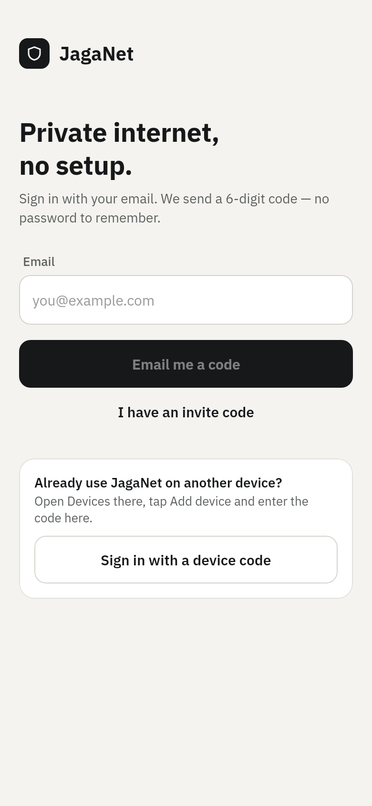
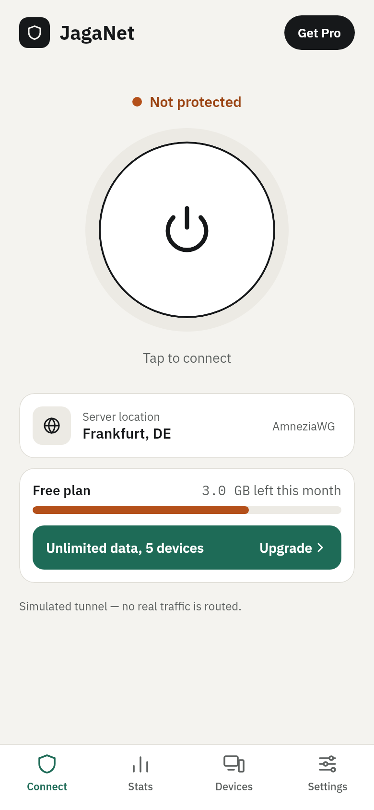
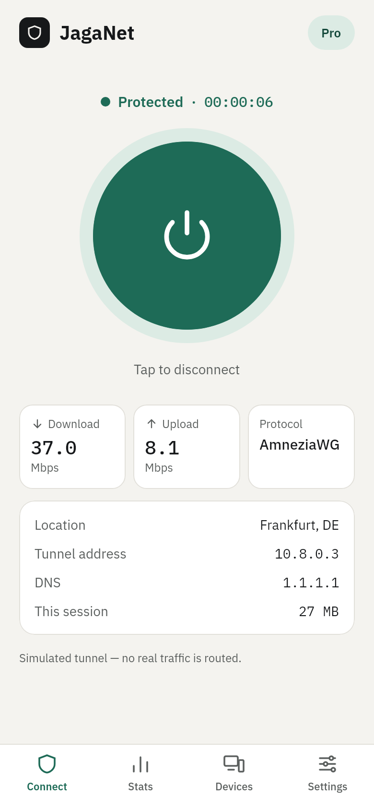
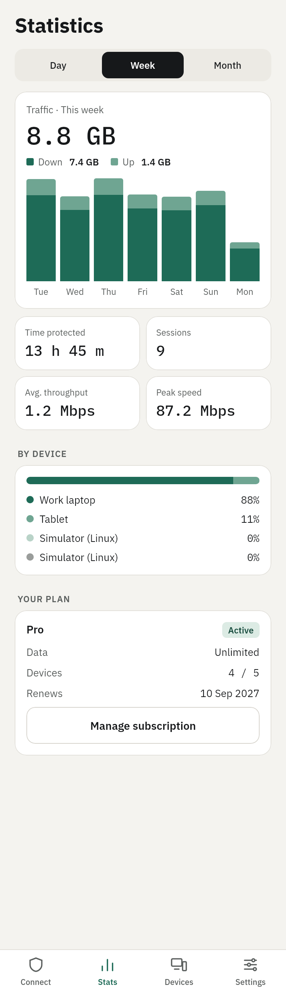
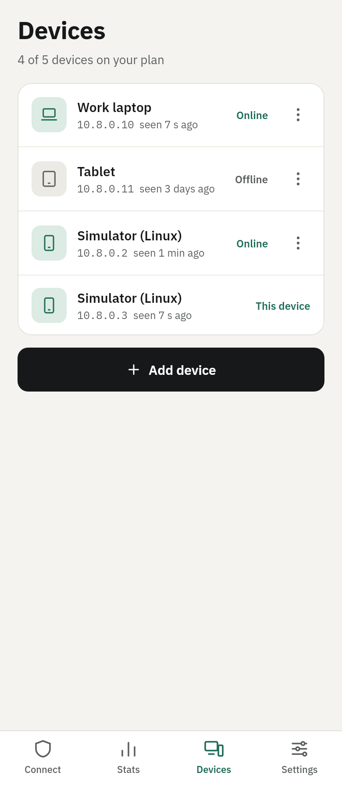
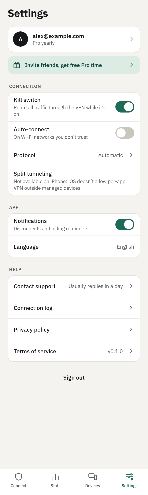
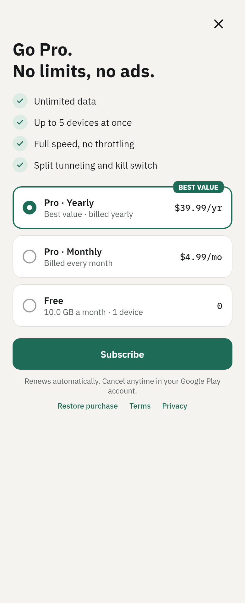
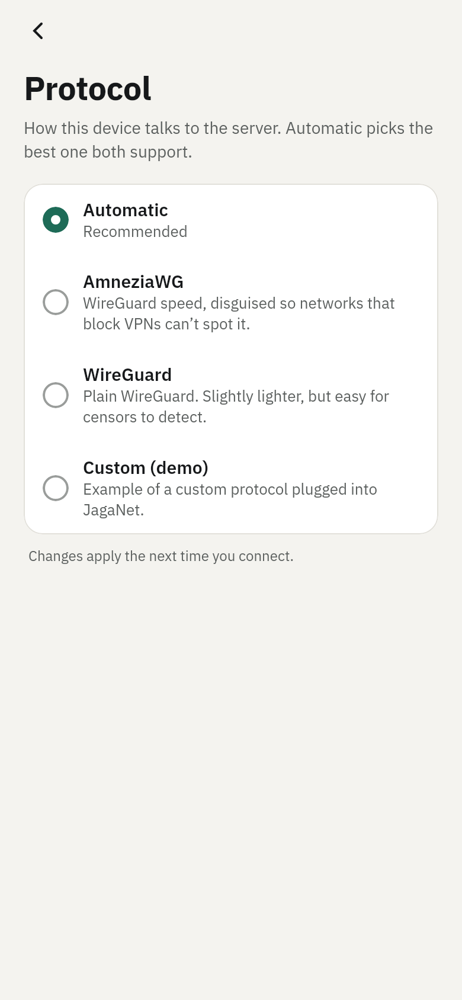
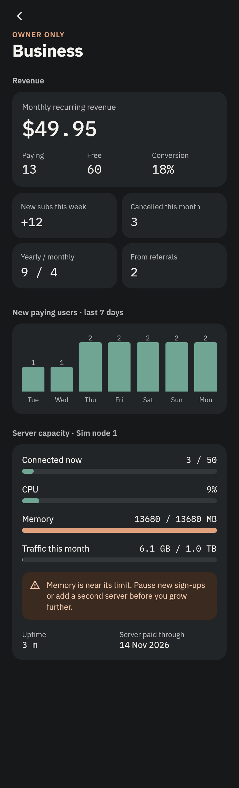

# Design

Source: the "Mini VPN App" design canvas (11 iPhone-size artboards). The implementation follows
it screen by screen; screenshots of the running app come from `./gradlew :composeApp:screenshots`.

## Design system

All values live in `composeApp/.../theme/Theme.kt`. Screens use token names only.

| Token | Value | Use |
|---|---|---|
| `paper` | `#F4F3EF` | screen background |
| `surface` | `#FFFFFF` | cards, tab bar |
| `ink` | `#16181A` | text, dark buttons |
| `muted` | `#5C605F` | secondary text (4.5:1 on paper) |
| `line` / `lineSoft` / `lineStrong` | `#E2E0DA` / `#ECEAE4` / `#D6D3CC` | borders, dividers, tracks |
| `green` / `greenDark` / `greenTint` | `#1E6B57` / `#14493B` / `#DCEBE4` | protected, primary, selected |
| `warn` / `warnText` | `#B4501A` / `#9A4312` | not protected, quota, destructive |
| `night*`, `chartGreen`, `alert*` | dark palette | owner dashboard, log console |

- **Type:** IBM Plex Sans (400/500/600/700) for UI, IBM Plex Mono (400/500) for every number,
  address and code. Scale: 34 / 28 / 24 / 20 / 15 / 14 / 13 / 12 / 11.
- **Shape:** radius 10 (icon tiles), 12 (buttons), 14 (stat tiles), 16 (cards), 18 (plan card).
- **Touch:** controls are ≥ 44 pt, primary buttons 50 pt.
- **Icons:** 24-grid stroke icons from the canvas (`ui/Icons.kt`), round caps, 1.8 stroke.
- Fonts are © IBM, SIL Open Font License 1.1.

## Screens

| Draft | Implemented as | Notes |
|---|---|---|
| Home · free / connected | `HomeScreen` | One screen, two states. Shows a banner with the fix when the plan blocks a connect (data or device limit) |
| Statistics | `StatsScreen` | Real data from `/v1/stats`. "Avg. speed" became **Avg. throughput**: the server knows bytes over time protected, not line speed |
| Devices | `DevicesScreen` | Online/offline from the last handshake. ⋯ opens Remove. "Add device" shows the 6-digit pairing code |
| Settings | `SettingsScreen` | Adds **Protocol** and an **Owner** section (owner only) |
| Plans / paywall | `PlansScreen` | Prices come from the store at runtime; the server's display prices are placeholders |
| Account & subscription | `AccountScreen` | Delete account asks for confirmation inline |
| Invite friends | `ReferralScreen` | Reward days are a server setting |
| Owner dashboard | `AdminScreen` | Live from `/v1/admin/overview`. Warnings are computed (memory, peer slots, traffic) |
| Split tunneling | `SplitTunnelScreen` | Android only, see below |
| Connection log | `LogsScreen` | Device-only. "Export .txt" became **Share** (system share sheet) |

### Added screens (not in the drafts)

- **Sign in** (email), **Check your email** (6-digit code), **Enter device code** (sign in with a
  code from another device). The drafts start signed in. In simulation the code is shown on screen.
- **Protocol**: Automatic (recommended) / AmneziaWG / WireGuard, with a plain-language description
  each. Options the device can't run are disabled, not hidden.

### Platform decisions

- **Split tunneling on iPhone:** iOS only allows per-app VPN on supervised (MDM) devices. The
  row stays in Settings with that explanation instead of a control that can't work.
- **Kill switch:** iOS uses `includeAllNetworks`. Android can't enforce it from an app; the full
  version is the system's "Always-on VPN + Block connections without VPN" (a guidance screen is a
  next step).
- **Start on boot:** Android only. iOS reconnects through on-demand rules instead.
- **Name:** the drafts say "Burrow". The app uses **JagaNet** from one constant (`APP_NAME`).

## Screenshots

Rendered from the shared Compose code at 390×844 pt (`./gradlew :composeApp:screenshots`):

| | | |
|---|---|---|
|  |  |  |
|  |  |  |
|  |  |  |
